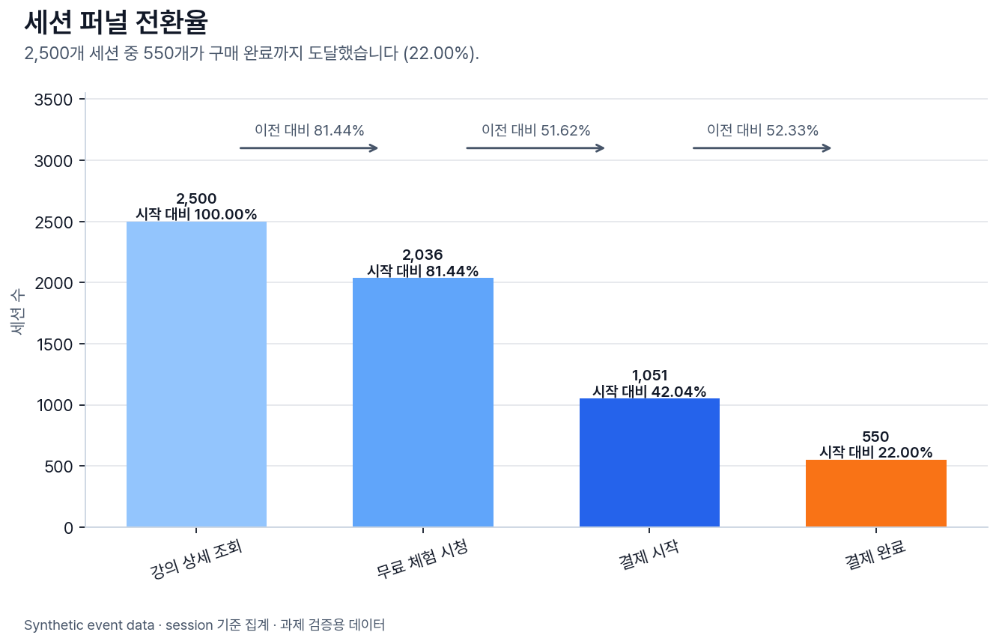
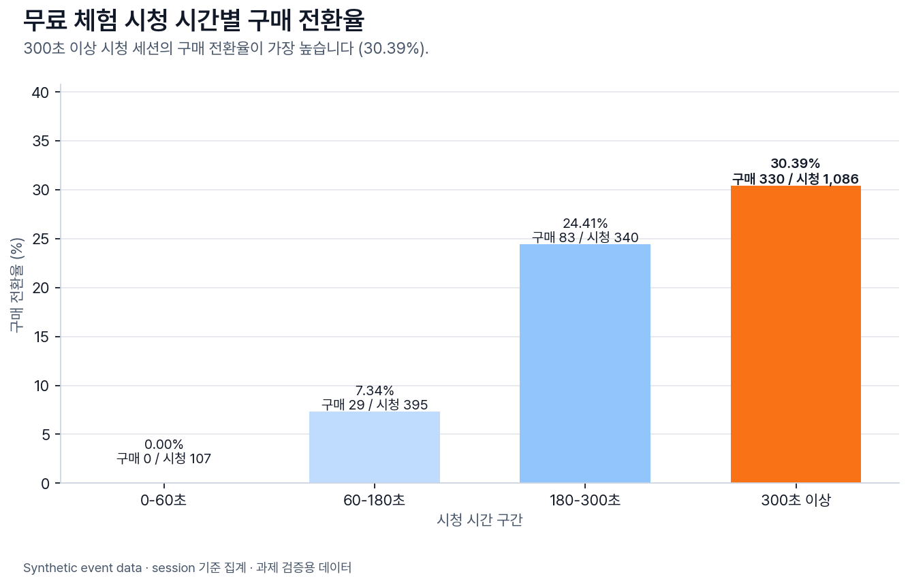
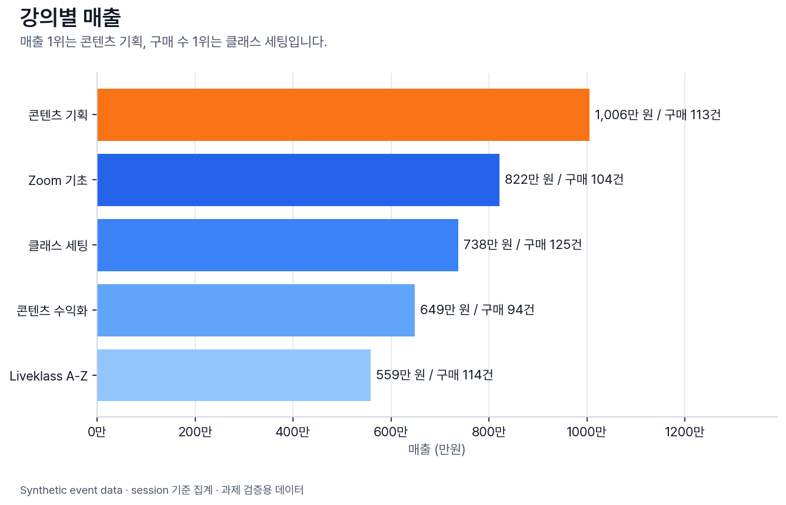
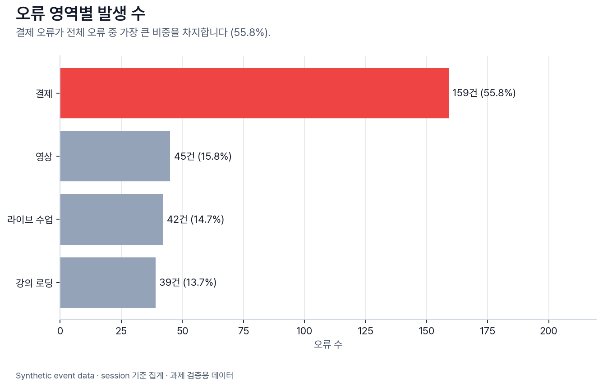
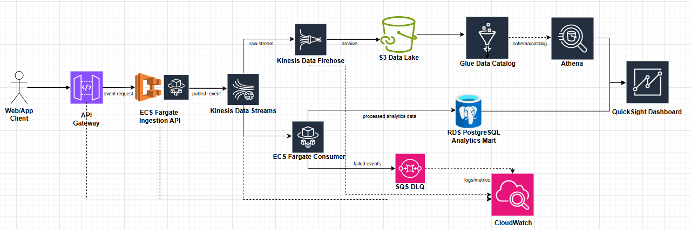

# Liveklass Event Pipeline Assignment

Liveklass와 같은 온라인 강의 플랫폼에서 발생할 수 있는 synthetic event를 생성하고,
PostgreSQL에 적재한 뒤 SQL 집계와 PNG 시각화를 통해 학습/결제 전환 인사이트를 확인하는 데이터 엔지니어링 과제입니다.

## 프로젝트 개요

이번 구현의 목표는 단순히 이벤트를 많이 만드는 것이 아니라,
분석 가능한 형태의 raw event log를 설계하고 적재한 뒤 실제 비즈니스 질문에 가까운 지표로 검증하는 것입니다.

현재 구현 범위는 다음과 같습니다.

1. session 기반 synthetic event generator
2. PostgreSQL `events` raw log table
3. 1,000건 단위 batch insert
4. 분석용 SQL 쿼리
5. `matplotlib` 기반 PNG 시각화

## 문제 접근 방식

먼저 운영 서비스의 정규화된 사용자/강의/결제 테이블을 만드는 대신,
분석에 필요한 사용자 행동을 하나의 `events` 테이블에 append하는 구조를 선택했습니다.

이 방식은 원본 이벤트를 최대한 보존한 뒤, SQL 분석 단계에서 session funnel, 강의별 매출,
무료 체험 시청 깊이별 전환율, 오류 영역별 발생 수 같은 분석 결과를 가공하기 쉽습니다.
현업에서도 raw event는 단일 event table 또는 날짜별 event table에 저장하고,
분석 목적에 따라 funnel, revenue, retention mart로 분리하는 방식이 일반적입니다.

## 이벤트 및 시나리오 설계

현재 설계한 이벤트 타입은 다음과 같습니다.

- `page_view`: 랜딩, 강의 목록, 커뮤니티 등 일반 페이지 방문
- `course_view`: 특정 강의 상세 페이지 조회
- `lesson_started`: 무료 체험 콘텐츠 또는 유료 수강 콘텐츠 시청 시작
- `lesson_completed`: 무료 체험 콘텐츠 또는 유료 수강 콘텐츠 시청 완료
- `checkout_started`: 결제 시작
- `purchase_completed`: 결제 완료
- `error_occurred`: 결제, 영상, 라이브 수업, 강의 시청 중 오류 발생

이벤트는 완전 무작위가 아니라 온라인 강의 플랫폼에서 발생할 수 있는 대표 session scenario를 기반으로 생성합니다.
각 session은 하나의 `session_id`를 공유하며, 내부 이벤트 시간은 사용자의 행동 흐름에 맞춰 순차적으로 증가합니다.

대표 scenario는 다음과 같습니다.

- `browse_only`: 강의 탐색 후 이탈
- `preview_dropoff`: 무료 체험 콘텐츠 시청 중 이탈
- `preview_completed_no_purchase`: 무료 체험 콘텐츠 완료 후 미구매
- `checkout_abandoned`: 결제 시작 후 이탈
- `preview_to_purchase`: 무료 체험 콘텐츠 시청 후 결제 완료
- `payment_error`: 결제 중 오류 발생
- `paid_learning`: 결제 후 유료 콘텐츠 수강

이 구조를 통해 `session_id` 기준으로 무료 체험 시청 시간, 결제 시작, 결제 완료, 오류 발생 흐름을 함께 분석할 수 있습니다.
또한 synthetic data가 특정 시청 시간 구간에서만 전환되도록 고정하지 않고,
짧게 보고도 구매하는 session과 오래 보고도 미구매하는 session이 함께 나오도록 일부 overlap을 두었습니다.
이를 통해 시청 시간이 구매 전환에 영향을 주는 경향은 보이되, 실제 사용자 행동처럼 예외도 존재하도록 설계했습니다.

## 스키마와 인덱스 설계 이유

`events` 테이블은 분석을 위한 raw event log 저장소입니다.
`event_type`이 각 row의 의미를 결정하며, 이벤트별로 필요하지 않은 필드는 `NULL`을 허용합니다.

- `session_id`: 로그인 여부와 관계없이 하나의 방문 흐름을 추적합니다.
- `event_type`: funnel step, 결제, 오류 등 row의 분석 의미를 결정합니다.
- `duration_seconds`: 페이지 체류 시간 또는 강의 콘텐츠 시청 시간을 초 단위로 저장합니다.
- `amount`: `purchase_completed` 이벤트에서 원화 기준 결제 금액을 저장합니다.
- `error_area`: `error_occurred` 이벤트에서 결제/영상/라이브/강의 영역을 구분합니다.

주요 분석 쿼리가 `event_type`, `session_id`, `course_id`, `event_time`을 중심으로 동작하므로 해당 column에 인덱스를 추가했습니다.
복합 인덱스는 결제 전환 분석과 강의별 매출 분석처럼 자주 사용할 조건 조합을 기준으로 최소한만 추가했습니다.
또한 `event_type`, `user_type`, `duration_seconds`, `amount`에는 기본적인 `CHECK` constraint를 두어 잘못된 이벤트 값이 적재되지 않도록 했습니다.
파티셔닝은 실제 운영 트래픽과 보관 주기가 확인된 뒤 적용하는 것이 적절하다고 판단했습니다.

## 적재 및 검증 과정

Docker Compose로 PostgreSQL과 Python app을 함께 실행합니다.

제출 결과를 한 번에 재현하려면 다음 스크립트를 실행합니다.

```bash
bash scripts/run_pipeline.sh
```

이 스크립트는 PostgreSQL을 실행한 뒤 synthetic event를 적재하고,
`sql/analysis_queries.sql`을 실행한 다음 `charts/`에 최종 PNG 이미지를 생성합니다.

Docker Compose 요구사항인 앱 + DB 실행과 이벤트 생성/저장만 확인하려면 다음 명령어를 사용할 수 있습니다.

```bash
docker compose up --build
```

기본 실행에서는 2,500개 session에서 약 10,000건의 synthetic event를 생성하고,
1,000건 단위 batch로 PostgreSQL에 적재합니다.
batch insert는 대량 이벤트 적재 상황을 단순하게 재현하기 위해 선택했습니다.
이벤트 수는 session scenario별 이벤트 개수가 달라서 정확히 고정하지 않고, session 수 기준으로 약 1만 건이 생성되도록 설계했습니다.
기본 generator는 고정된 `seed`와 기준 시간을 사용하므로 같은 코드와 설정에서는 동일한 synthetic event를 재현할 수 있습니다.

실행 흐름은 다음과 같습니다.

```text
PostgreSQL readiness 확인
→ sql/init.sql 실행
→ events table TRUNCATE
→ synthetic events 생성
→ 1,000건 단위 batch insert
→ SELECT COUNT(*) FROM events
```

실행 로그 예시는 다음과 같습니다.

```text
PostgreSQL 준비 완료
데이터베이스 스키마 초기화 완료
events 테이블 초기화 완료
2500개 session에서 합성 이벤트 10008건 생성
배치 1 적재 완료: 1000행
...
배치 11 적재 완료: 8행
PostgreSQL에 이벤트 10008건 적재 완료
events 테이블 행 수: 10008
```

과제 재현성을 위해 실행 시 `events` 테이블을 초기화한 뒤 synthetic event를 적재합니다.
실제 운영 환경에서는 append-only 방식으로 이벤트를 누적하고, partitioning 또는 retention policy를 적용하는 것이 일반적입니다.

DB에 직접 접속해서 확인하려면 다음 명령어를 사용할 수 있습니다.

```bash
docker exec -it liveklass-postgres psql -U liveklass -d liveklass
```

분석 쿼리는 다음 명령어로 실행할 수 있습니다.

```bash
docker exec -i liveklass-postgres psql -U liveklass -d liveklass < sql/analysis_queries.sql
```

각 지표별 SQL은 `sql/queries/`에도 개별 파일로 분리되어 있습니다.
예를 들어 특정 지표만 확인하고 싶다면 다음처럼 실행할 수 있습니다.

```bash
docker exec -i liveklass-postgres psql -U liveklass -d liveklass < sql/queries/session_funnel.sql
```

## 지표 선정 이유

이번 과제에서는 단순 이벤트 발생 수보다, 온라인 강의 비즈니스에서 실제로 의사결정에 가까운 지표를 우선했습니다.

1. Session funnel conversion
   - `course_view → lesson_started → checkout_started → purchase_completed` 흐름에서 어디서 이탈하는지 보기 위한 지표입니다.
2. Free preview watch time conversion
   - 무료 체험 시청 시간이 길어질수록 구매 전환으로 이어지는지 확인하기 위한 지표입니다.
3. Course revenue
   - 어떤 강의가 매출에 기여하는지 보기 위한 지표입니다. 가격 차이가 있으므로 구매 수와 매출을 함께 봅니다.
4. Errors by area
   - 결제, 영상, 라이브 수업, 강의 로딩 중 어떤 영역에서 운영 이슈가 많이 발생하는지 확인하기 위한 지표입니다.

시간대별 클릭률은 이번 분석에서 제외했습니다.
현재 이벤트 설계에는 `impression` 이벤트가 없어 CTR을 정확히 정의하기 어렵고,
synthetic event의 시간대 분포도 랜덤이므로 과제 제출용 핵심 인사이트로는 적합하지 않다고 판단했습니다.

## 시각화 결과

분석 결과는 `matplotlib` 기반 PNG로 생성합니다.
DB에 이벤트를 적재한 뒤 다음 명령어로 차트를 만들 수 있습니다.
차트는 핵심 전환 단계와 리스크 영역이 한눈에 보이도록 muted color와 강조 색상을 함께 사용했습니다.
각 PNG에는 담당자가 빠르게 해석할 수 있도록 핵심 insight subtitle과 집계 기준 footnote를 포함했습니다.
한글 title과 label이 Docker 환경에서도 동일하게 렌더링되도록 `Pretendard` 폰트를 repo에 포함해 사용합니다.

```bash
docker compose up --build -d
docker compose run --rm -v "$PWD/charts:/app/charts" app python -m src.visualize
```

## 테스트

로컬에서 테스트를 실행하려면 개발 의존성을 설치한 뒤 `pytest`를 실행합니다.

```bash
python3 -m pip install -r requirements-dev.txt
python3 -m pytest tests -q
```

Docker 이미지에는 실행에 필요한 runtime 의존성만 포함하고, `pytest`는 `requirements-dev.txt`로 분리했습니다.

### Session funnel conversion



강의 상세 조회 이후 무료 체험 시청, 결제 시작, 결제 완료로 이어지는 session 수를 보여줍니다.
단순 이벤트 수가 아니라 session 기준으로 계산해 실제 사용자 흐름의 이탈 지점을 보기 쉽도록 했습니다.

### Free preview watch time conversion



무료 체험 콘텐츠 시청 시간을 bucket으로 나누고, 각 bucket에서 구매 완료로 이어진 session 비율을 계산했습니다.
시청 시간이 구매 전환과 어떤 관계가 있는지 확인하기 위한 핵심 engagement 지표입니다.

### Course revenue



강의별 매출과 구매 수를 함께 표시합니다.
매출만 보면 가격이 높은 강의가 유리할 수 있으므로, 구매 수를 함께 보면서 해석할 수 있도록 했습니다.

### Errors by area



오류가 어느 영역에서 많이 발생했는지 보여줍니다.
결제 오류는 구매 전환에 직접 영향을 줄 수 있으므로, funnel 분석과 함께 확인할 운영 지표로 사용했습니다.

> 현재 데이터는 실제 사용자 데이터가 아니라 과제 검증을 위한 synthetic event입니다.
> 따라서 분석 결과는 실제 비즈니스 결론이 아니라, 이벤트 로그를 통해 어떤 분석이 가능한지 보여주는 예시입니다.

## 운영 확장 방향

이번 구현은 과제 범위를 고려해 Python generator가 batch-style로 이벤트를 생성하는 방식입니다.
실제 운영 환경에서는 이벤트 생성 API와 DB 사이에 Amazon Kinesis, SQS, Kafka 같은 queue/streaming layer를 둘 수 있습니다.

운영 확장 시 고려할 수 있는 구조는 다음과 같습니다.

- Kinesis/SQS/Kafka: 트래픽 급증 시 buffering 및 consumer 비동기 처리
- DLQ: 적재 실패 이벤트 격리 및 재처리
- S3 raw archive: 원본 이벤트 장기 보관 및 data lake 구성
- Athena/QuickSight: raw archive 기반 ad-hoc query 및 BI dashboard
- Partitioning/retention: event_time 기준 데이터 관리와 쿼리 성능 최적화

이를 통해 DB 부하를 완화하고, 장애 상황에서도 이벤트 손실을 줄이며,
분석 목적에 따라 raw log와 mart table을 분리해 운영할 수 있습니다.

## AWS 선택 과제

현재 로컬 batch pipeline을 AWS 운영 환경으로 확장하는 설계는 [docs/aws-architecture.md](docs/aws-architecture.md)에 정리했습니다.



핵심 방향은 PostgreSQL 직접 적재에서 끝내지 않고,
`Kinesis Data Streams`, `Kinesis Data Firehose`, `S3`, `RDS PostgreSQL`, `Glue`, `Athena`, `QuickSight`, `CloudWatch`, `SQS DLQ`를 조합해
실시간 이벤트 수집, raw archive, SQL 분석, BI 시각화, 장애 재처리가 가능한 구조로 확장하는 것입니다.

Kubernetes/EKS는 현재 과제의 필수 구현이 아니라 향후 container orchestration 확장안으로 검토했습니다.
현재 구조에서 어떤 부분에 적용할 수 있고 왜 당장은 ECS Fargate가 더 적절한지는 [docs/kubernetes-architecture.md](docs/kubernetes-architecture.md)에 정리했습니다.

### Kubernetes 선택 과제

Step 1에서 만든 이벤트 생성기 앱을 Kubernetes에서 실행한다고 가정하고, 최소 manifest 예시를 `k8s/`에 작성했습니다.

- [k8s/event-generator-configmap.yaml](k8s/event-generator-configmap.yaml)
  - `POSTGRES_DB`, `POSTGRES_USER`, `POSTGRES_HOST`, `POSTGRES_PORT`처럼 민감하지 않은 DB 연결 설정을 분리합니다.
  - container image나 code를 바꾸지 않고 환경별 설정만 바꿀 수 있도록 `ConfigMap`을 선택했습니다.
- [k8s/event-generator-job.yaml](k8s/event-generator-job.yaml)
  - `python -m src.main`을 한 번 실행해 synthetic event를 생성하고 PostgreSQL에 적재하는 batch 작업입니다.
  - 이벤트 생성기는 계속 떠 있는 API 서버가 아니라 실행 후 종료되는 작업이므로 `Deployment`보다 `Job`이 더 적합하다고 판단했습니다.

DB password는 실제 운영에서 `Secret`으로 관리해야 하므로 manifest에는 값을 직접 넣지 않고 `liveklass-db-secret`을 참조하도록 작성했습니다.
