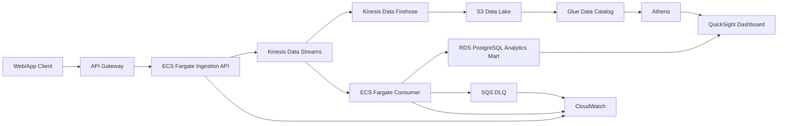

# AWS Architecture Proposal

이 문서는 현재 Liveklass synthetic event pipeline을 AWS 운영 환경으로 확장할 때의 간단한 설계안입니다.
실제 AWS 리소스, Terraform, CDK는 만들지 않고, 과제 선택 항목에 맞춰 데이터 흐름과 서비스 선택 이유만 정리합니다.

## 목표

현재 프로젝트는 Python app이 synthetic event를 생성하고 PostgreSQL에 batch insert한 뒤,
SQL과 PNG 차트로 funnel, conversion, revenue, error 지표를 분석합니다.

운영 환경에서는 이벤트가 갑자기 많이 들어오거나 DB 장애가 발생해도 원본 이벤트를 잃지 않는 구조가 필요합니다.
따라서 PostgreSQL에 바로 쓰는 대신, stream buffer와 raw data lake를 두는 방향으로 확장합니다.

## 전체 흐름

## 서비스 역할

| Service | 역할 |
| --- | --- |
| `API Gateway` | client가 이벤트를 보내는 HTTP endpoint입니다. 인증, rate limit, request validation, access log를 처리할 수 있습니다. |
| `ECS Fargate Ingestion API` | Docker image로 배포되는 이벤트 수집 서버입니다. payload를 검증하고 Kinesis에 event record를 넣습니다. |
| `Kinesis Data Streams` | 이벤트를 바로 DB에 쓰지 않고 잠시 받아두는 AWS managed stream buffer입니다. traffic burst, consumer 장애, replay에 대응하기 위한 핵심 계층입니다. |
| `Kinesis Data Firehose` | Kinesis stream 데이터를 S3로 자동 적재합니다. 직접 consumer code를 만들지 않아도 raw event archive를 안정적으로 쌓을 수 있습니다. |
| `S3 Data Lake` | 원본 이벤트를 장기 보관하는 raw archive입니다. 재처리, audit, 신규 KPI 계산의 기준 데이터가 됩니다. |
| `Glue Data Catalog` | S3에 저장된 파일의 schema와 partition 정보를 관리합니다. Athena가 S3 데이터를 table처럼 조회할 수 있게 합니다. |
| `Athena` | S3 data lake를 SQL로 조회하는 serverless query service입니다. 초기 분석과 ad-hoc query에 적합합니다. |
| `RDS PostgreSQL` | 현재 과제의 SQL 분석 구조를 이어받는 초기 analytics mart입니다. funnel/revenue/error 집계 결과를 저장하거나 조회합니다. |
| `QuickSight` | 담당자가 반복적으로 확인하는 BI dashboard입니다. Athena 또는 PostgreSQL을 연결해 전환율, 매출, 오류 지표를 시각화합니다. |
| `CloudWatch` | API/ECS/Kinesis/Firehose/DLQ의 log와 metric을 모니터링합니다. |
| `SQS DLQ` | 처리 실패 이벤트를 격리해 원인 분석과 재처리를 가능하게 합니다. |

## 왜 이 구조를 선택했는가

### PostgreSQL에 바로 쓰지 않는 이유

작은 batch 과제에서는 PostgreSQL 직접 적재가 충분합니다.
하지만 운영 환경에서는 이벤트 트래픽이 순간적으로 늘거나 DB가 느려질 수 있습니다.
이때 application server가 DB에 직접 write하면 이벤트 유실이나 장애 전파가 발생할 수 있습니다.

`Kinesis Data Streams`를 중간에 두면 producer와 consumer를 분리할 수 있고,
consumer가 지연되더라도 stream retention 안에서 다시 처리할 수 있습니다.

Kinesis는 Kafka와 유사하게 event stream을 buffer/replay할 수 있는 서비스입니다.
다만 broker cluster를 직접 운영하는 Kafka와 달리, AWS가 stream과 shard 운영을 관리하는 managed service로 이해하는 것이 정확합니다.
Kafka의 topic/partition과 비슷하게 Kinesis는 stream/shard 단위로 데이터를 나눠 처리합니다.

### S3 Data Lake를 두는 이유

PostgreSQL은 조회하기 좋은 structured mart이고, S3는 원본 이벤트를 보존하는 data lake입니다.
S3에 raw event를 남겨두면 consumer bug 수정 후 과거 데이터를 재처리하거나,
새 KPI가 생겼을 때 원본 기준으로 다시 계산할 수 있습니다.

### Athena를 먼저 쓰는 이유

초기 단계에서는 Redshift 같은 warehouse를 항상 운영하기보다,
S3에 쌓인 데이터를 Athena로 직접 조회하는 편이 단순하고 비용 부담이 낮습니다.
Athena는 serverless 방식으로 S3 데이터를 SQL 조회할 수 있어 과제 규모와 초기 운영 단계에 적합합니다.

`Glue Data Catalog`는 S3 파일을 table처럼 인식하게 해주는 metadata 계층이고,
`Athena`는 그 catalog를 사용해 실제 SQL query를 실행하는 분석 계층입니다.
따라서 catalog만으로 분석이 끝나는 것이 아니라, SQL 조회가 필요하면 Athena까지 연결합니다.

### QuickSight까지 연결하는 이유

개발자나 데이터 엔지니어가 일회성으로 확인할 때는 Athena SQL만으로도 충분합니다.
하지만 funnel conversion, preview watch conversion, course revenue, error count처럼 담당자가 반복적으로 보는 KPI는 dashboard가 필요합니다.
로컬 과제에서 `matplotlib` PNG로 보여준 결과를 AWS 운영 환경에서는 QuickSight dashboard로 제공한다고 볼 수 있습니다.

### RDS PostgreSQL을 유지하는 이유

현재 과제는 PostgreSQL schema와 SQL 분석 쿼리를 이미 구현했습니다.
따라서 초기 운영 설계에서는 PostgreSQL을 analytics mart로 유지하면 기존 쿼리와 검증 방식을 자연스럽게 확장할 수 있습니다.
다만 데이터가 장기적으로 커지면 대량 scan과 반복 dashboard query에는 columnar warehouse가 더 적합할 수 있습니다.

## 향후 확장 옵션

### Redshift

데이터량이 커지고 반복적인 BI query가 많아지면 Amazon Redshift를 도입할 수 있습니다.
Redshift는 columnar data warehouse이므로 대량 event aggregation, 복잡한 join, dashboard 성능 요구에 더 적합합니다.
현재 단계에서는 비용과 복잡도를 고려해 `S3 + Glue + Athena`를 먼저 사용하고,
성능 요구가 커질 때 Redshift를 추가하는 방향이 적절합니다.

### Kafka 또는 Amazon MSK

Kafka는 대규모 streaming platform으로 좋은 선택지지만,
production 환경에서는 broker cluster, partition, replication, storage, monitoring을 함께 운영해야 합니다.
Amazon MSK를 사용해도 broker instance와 storage 비용이 발생합니다.

이번 과제는 AWS 기반 clickstream 수집과 raw archive가 핵심이므로,
초기에는 Kinesis Data Streams를 사용해 운영 복잡도를 낮추는 것이 더 현실적입니다.
향후 조직 내 Kafka 표준, multi-cloud 요구, 복잡한 stream processing 요구가 생기면 MSK 도입을 검토할 수 있습니다.

## 운영 모니터링

CloudWatch에서는 다음 항목을 우선 확인합니다.

- API request count, error count, p95 latency
- Kinesis incoming records, write failure, iterator age
- Firehose delivery success/failure
- Consumer success/failure count
- PostgreSQL insert count와 connection error
- S3 raw event partition freshness
- DLQ message count와 oldest message age
- QuickSight dashboard refresh status

## 요약

이 설계의 핵심은 PostgreSQL 직접 적재에서 끝내지 않고,
`API Gateway → ECS Fargate → Kinesis → S3 Data Lake → Glue/Athena → QuickSight` 흐름으로 확장하는 것입니다.

Kinesis는 traffic burst와 consumer 장애를 흡수하고,
S3는 원본 이벤트를 장기 보관하며,
Athena와 PostgreSQL은 초기 분석을 담당합니다.
Redshift와 Kafka/MSK는 현재 단계에서는 필수가 아니지만, 데이터 규모와 조직 요구가 커질 때 확장 옵션으로 남겨둡니다.
