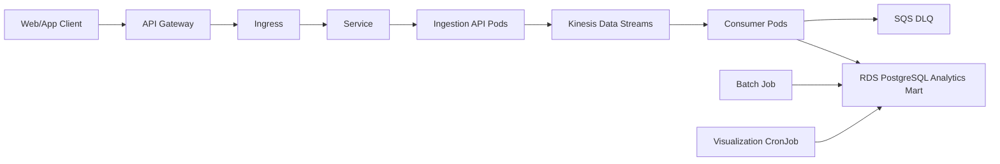

# Kubernetes / EKS Extension Review

이 문서는 Liveklass event pipeline을 Kubernetes까지 확장할 수 있는지 검토한 내용입니다.
현재 과제의 핵심은 이벤트 생성, PostgreSQL 적재, SQL 분석, PNG 시각화입니다.
따라서 Kubernetes를 전체 운영 환경으로 바로 구현하기보다는, Step 1 이벤트 생성기 앱을 기준으로 최소 manifest를 작성하고 운영 확장 가능성을 검토했습니다.

## 현재 과제 기준 판단

현재 구현은 Docker Compose로 `app` container와 PostgreSQL을 실행합니다.
과제 제출과 재현성만 보면 이 구조가 가장 단순합니다.

AWS 확장안에서는 `ECS Fargate`를 사용해 container를 실행하는 방향을 먼저 잡았습니다.
이유는 현재 프로젝트가 작은 Python/Docker app이고, container orchestration을 세밀하게 운영해야 할 정도로 서비스가 복잡하지 않기 때문입니다.

Kubernetes는 지금 당장 필수는 아니지만, 다음과 같은 상황이 되면 고려할 수 있습니다.

- ingestion API와 consumer를 독립적으로 배포해야 하는 경우
- API 서버와 consumer 서버의 scale 기준이 달라지는 경우
- batch job과 scheduled analysis job을 운영 환경에서 주기적으로 실행해야 하는 경우
- 팀 또는 회사의 표준 container 운영 환경이 EKS인 경우
- rolling update, self-healing, HPA 같은 Kubernetes 운영 기능이 필요한 경우

즉 이번 과제에서는 `ECS Fargate`가 메인 운영안이고, `EKS/Kubernetes`는 향후 확장안으로 보는 것이 맞다고 판단했습니다.

## 이 프로젝트에 Kubernetes를 적용한다면

Kubernetes를 도입한다면 데이터 저장/분석 계층을 바꾸는 것이 아니라, container 실행 계층을 바꾸는 것입니다.
`Kinesis`, `S3`, `RDS PostgreSQL`, `Athena`, `QuickSight` 같은 데이터 계층은 기존 AWS 설계를 그대로 둡니다.



이 구조에서 Kubernetes가 담당하는 부분은 `Ingress`, `Service`, `Pod`, `Deployment`, `Job`, `CronJob`입니다.
이벤트 저장소나 BI 도구를 Kubernetes 안으로 옮기는 구조는 아닙니다.

## API Gateway와 Kubernetes의 역할

`API Gateway`는 사용자가 이벤트를 보내는 첫 번째 진입점입니다.
여기서 인증, rate limit, request validation, access log 같은 API 앞단 기능을 처리할 수 있습니다.

다만 `API Gateway`는 Kubernetes가 관리하는 Pod가 아닙니다.
AWS가 관리하는 외부 서비스이고, Kubernetes는 그 뒤에서 실제 application container를 운영합니다.

운영 흐름은 다음처럼 이해했습니다.

```text
Web/App Client
→ API Gateway
→ Ingress
→ Service
→ Ingestion API Pods
→ Kinesis Data Streams
```

`API Gateway`는 하나의 API endpoint처럼 보이지만, 내부 가용성과 확장은 AWS가 관리합니다.
반면 `Ingestion API Pods`를 몇 개 띄울지, Pod가 죽었을 때 다시 띄울지, 배포를 어떻게 교체할지는 Kubernetes의 `Deployment`가 담당합니다.

## Ingestion API는 Deployment로 운영

운영 환경에서는 client event request를 받는 ingestion API가 필요합니다.
이 API는 여러 Pod로 띄울 수 있으므로 Kubernetes에서는 `Deployment`가 적합합니다.

```text
Deployment: ingestion-api
→ Pod 1
→ Pod 2
→ Pod 3
```

이렇게 구성하면 요청량이 많아질 때 HPA로 Pod 수를 늘릴 수 있고,
배포 시에는 rolling update로 새 version을 점진적으로 교체할 수 있습니다.

주의할 점은 API Gateway가 Pod를 직접 늘리는 것이 아니라는 점입니다.
API Gateway는 요청을 받아 뒤쪽으로 넘겨주는 managed entrypoint이고,
Pod 확장은 Kubernetes의 Deployment/HPA가 처리합니다.

## Consumer도 Deployment로 분리

Kinesis에 들어간 event는 consumer가 읽어서 PostgreSQL analytics mart에 적재합니다.
이 consumer도 계속 실행되는 workload이므로 `Deployment`로 운영하는 것이 자연스럽습니다.

```text
Kinesis Data Streams
→ Consumer Pods
→ RDS PostgreSQL Analytics Mart
```

consumer를 API와 분리하는 이유는 두 작업의 scale 기준이 다르기 때문입니다.
API는 request latency와 요청 수가 중요하고, consumer는 Kinesis backlog, 처리량, DB insert 성능이 중요합니다.

consumer Pod를 여러 개 띄우면 병렬 처리가 가능하지만, 무조건 Pod만 늘린다고 처리량이 늘어나는 것은 아닙니다.
Kinesis의 `shard`가 Kafka의 `partition`과 비슷한 병렬 처리 단위이기 때문에,
consumer replica 수는 shard 수, event volume, consumer lag을 함께 보고 조정해야 합니다.

처리 실패 이벤트는 버리지 않고 `SQS DLQ`로 보내는 구조가 적절합니다.
DLQ에 쌓인 이벤트는 원인을 확인한 뒤 재처리할 수 있습니다.

## Batch 작업은 Job으로 분리

현재 프로젝트의 `python -m src.main`은 synthetic event를 생성하고 PostgreSQL에 적재하는 batch성 작업입니다.
이 작업은 사용자가 API Gateway로 요청하는 실시간 ingestion 흐름과는 다릅니다.

Kubernetes에서는 이런 일회성 작업을 `Job`으로 표현할 수 있습니다.

```text
Job
→ python -m src.main
→ RDS PostgreSQL
```

즉 batch load는 ingestion API 앞단에 붙는 것이 아니라, 필요할 때 별도로 실행되는 작업으로 보는 것이 더 정확합니다.

## 시각화와 리포트는 CronJob으로 확장 가능

현재는 `python -m src.visualize`를 수동으로 실행해 PNG 차트를 생성합니다.
운영 환경에서 이 작업을 매일 또는 매시간 자동 실행해야 한다면 `CronJob`으로 확장할 수 있습니다.

```text
CronJob
→ python -m src.visualize
→ chart 생성 또는 summary table 갱신
```

다만 `QuickSight` 자체를 Job으로 만드는 것은 아닙니다.
QuickSight는 dashboard 서비스이고, Job/CronJob은 QuickSight가 볼 데이터나 리포트 산출물을 준비하는 역할에 가깝습니다.

복잡한 dependency, retry, backfill이 필요한 데이터 파이프라인이라면 Kubernetes CronJob보다 Airflow가 더 적합할 수 있습니다.
이번 과제에서는 단순 주기 실행 아이디어로만 CronJob을 남겨두는 것이 적절합니다.

## 내가 잡은 적용 범위

이번 과제에서는 Kubernetes 전체 운영 구성을 만드는 대신, 이벤트 생성기 앱에 필요한 최소 manifest만 추가하는 것이 낫다고 판단했습니다.
이유는 다음과 같습니다.

- 현재 app은 실제 ingestion API server가 아니라 synthetic event generator 중심입니다.
- 실제 cluster에 배포하지 않는 조건이므로 너무 많은 YAML을 추가하면 형식적인 산출물이 될 수 있습니다.
- AWS 운영안에서는 ECS Fargate만으로도 container 실행 요구를 충분히 설명할 수 있습니다.
- Kubernetes는 데이터 파이프라인 자체보다 container 운영 확장 주제에 가깝습니다.

그래서 이번 단계에서는 Kubernetes를 다음처럼 위치시켰습니다.

```text
현재 제출 구현
→ Docker Compose 기반 로컬 재현

AWS 운영 기본안
→ ECS Fargate + Kinesis + S3 + RDS + Athena + QuickSight

향후 확장안
→ EKS에서 ingestion API, consumer, batch job, CronJob을 운영
```

이번 PR에서 작성한 manifest는 다음 두 가지입니다.

- `k8s/event-generator-configmap.yaml`: DB 연결 설정 중 민감하지 않은 값을 관리합니다.
- `k8s/event-generator-job.yaml`: `python -m src.main`을 실행하는 일회성 batch 작업을 정의합니다.

## ECS Fargate와 비교

| 기준 | ECS Fargate | EKS / Kubernetes |
| --- | --- | --- |
| 초기 적용 | 단순함 | 준비할 개념과 설정이 많음 |
| 운영 부담 | 낮음 | 상대적으로 높음 |
| 배포 단위 | task/service | Pod/Deployment/Job |
| 확장 방식 | ECS Service Auto Scaling | HPA, Deployment, Cluster Autoscaler |
| AWS 연동 | 매우 자연스러움 | 가능하지만 설정이 더 많음 |
| 적합한 시점 | 작은 container 서비스, 빠른 운영화 | 여러 workload를 세밀하게 운영해야 할 때 |

내 판단으로는 현재 과제에는 ECS Fargate가 더 현실적인 선택입니다.
Kubernetes는 서비스가 커지고 API, consumer, batch, scheduler를 독립적으로 운영해야 할 때 도입하는 것이 더 설득력 있습니다.

## 향후 실제로 추가한다면

실제 운영 manifest를 확장한다면 처음부터 많은 YAML을 추가하기보다 현재 Job 예시에서 필요한 리소스만 단계적으로 늘리는 것이 좋습니다.

```text
k8s/ingestion-api-deployment.yaml
k8s/ingestion-api-service.yaml
k8s/consumer-deployment.yaml
k8s/visualization-cronjob.yaml
k8s/secret.yaml
```

이 파일들은 실제 ingestion API와 consumer가 구현된 뒤 추가하는 것이 자연스럽습니다.
현재는 Step 1 이벤트 생성기 앱 기준으로 `ConfigMap`과 `Job`만 두는 것이 과제 범위에 가장 잘 맞습니다.

## 참고 자료

- [Kubernetes concepts](https://kubernetes.io/docs/concepts/)
- [Kubernetes Deployments](https://kubernetes.io/docs/concepts/workloads/controllers/deployment/)
- [Kubernetes Services](https://kubernetes.io/docs/concepts/services-networking/service/)
- [Kubernetes Jobs](https://kubernetes.io/docs/concepts/workloads/controllers/job/)
- [Kubernetes CronJobs](https://kubernetes.io/docs/concepts/workloads/controllers/cron-jobs/)
- [Amazon EKS](https://docs.aws.amazon.com/eks/latest/userguide/what-is-eks.html)
