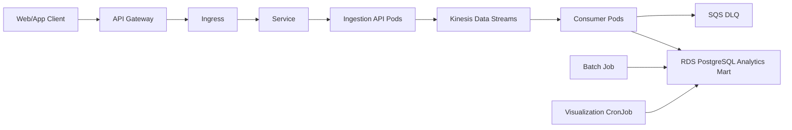

# Kubernetes / EKS Extension Proposal

이 문서는 Liveklass event pipeline을 Kubernetes로 확장한다면 어떤 방식이 적절한지 정리한 학습용 설계안입니다.
이번 단계에서는 실제 Kubernetes manifest를 만들지 않고, 기본 개념과 현재 프로젝트에 대한 매핑을 먼저 설명합니다.

## 왜 Kubernetes를 고려하는가

현재 프로젝트는 Docker Compose로 PostgreSQL과 Python app을 로컬에서 실행합니다.
AWS 운영 설계에서는 `ECS Fargate`로 container를 실행하고, `Kinesis`, `S3`, `RDS PostgreSQL`, `Athena`, `QuickSight`를 연결하는 구조를 제안했습니다.

Kubernetes는 이 중 container 실행 계층을 더 세밀하게 운영하고 싶을 때 고려할 수 있습니다.
예를 들어 ingestion API, event consumer, batch job, scheduled analytics job을 각각 독립적으로 배포하고 확장해야 한다면 Kubernetes가 유용합니다.

다만 현재 과제 규모에서는 `ECS Fargate`가 더 단순하고 운영 부담이 낮습니다.
따라서 Kubernetes는 필수 구현이 아니라, 서비스가 커졌을 때의 `EKS` 기반 확장 옵션으로 보는 것이 적절합니다.

## 핵심 개념

| Kubernetes 개념 | 쉽게 이해하기 | Liveklass 적용 예시 |
| --- | --- | --- |
| `Cluster` | Kubernetes가 실행되는 전체 환경 | AWS `EKS` cluster |
| `Node` | Pod가 실제로 실행되는 서버 | EC2 managed node group 또는 EKS Fargate |
| `Pod` | container 실행 최소 단위 | ingestion API pod, consumer pod |
| `Deployment` | Pod 개수와 rolling update를 관리 | ingestion API 2~3개 유지 |
| `Service` | Pod 앞에 붙는 내부 고정 주소 | ingestion API 내부 endpoint |
| `Ingress` | 외부 HTTP 요청을 Service로 라우팅 | `/events` 요청을 ingestion API로 전달 |
| `ConfigMap` | 일반 설정값 관리 | DB host, batch size, log level |
| `Secret` | 민감한 설정값 관리 | DB password, API key |
| `Job` | 한 번 실행하고 종료되는 작업 | synthetic event load, chart generation |
| `CronJob` | 주기적으로 실행되는 Job | 매일 새벽 분석/리포트 생성 |
| `HPA` | metric 기준으로 Pod 수 자동 조절 | 요청 증가 시 ingestion API scale-out |

## 현재 구조와 Kubernetes 매핑

현재 Docker Compose 기반 실행 단위는 다음처럼 Kubernetes 리소스로 옮길 수 있습니다.

| 현재 구성 | Kubernetes 확장안 | 설명 |
| --- | --- | --- |
| `app` container | `Job` | `python -m src.main`을 실행해 synthetic event를 생성하고 DB에 적재합니다. |
| `src.visualize` 실행 | `Job` 또는 `CronJob` | DB 분석 결과를 읽고 PNG 차트를 생성합니다. |
| PostgreSQL container | `RDS PostgreSQL` | 운영 환경에서는 DB를 Pod로 띄우기보다 managed database를 사용합니다. |
| AWS `Ingestion API` | `Deployment` + `Service` + `Ingress` | client event request를 받고 Kinesis에 publish합니다. |
| AWS `Consumer` | `Deployment` | Kinesis에서 event를 읽어 PostgreSQL analytics mart에 적재합니다. |
| 환경변수 | `ConfigMap` + `Secret` | 일반 설정과 민감 정보를 분리합니다. |

## EKS 적용 흐름



이 구조에서 Kubernetes가 직접 데이터 분석을 수행하는 것은 아닙니다.
Kubernetes는 containerized workload를 안정적으로 실행하고 배포/확장하는 역할을 담당합니다.
데이터 저장과 분석은 기존 AWS 설계처럼 `Kinesis`, `S3`, `RDS PostgreSQL`, `Athena`, `QuickSight`가 담당합니다.

`API Gateway`는 Kubernetes 안에서 실행되는 Pod가 아니라 AWS managed API entrypoint입니다.
사용자 요청을 먼저 받고, 인증, rate limit, request validation, access log 같은 API 앞단 역할을 수행합니다.
Kubernetes는 그 뒤에서 `Ingress`, `Service`, `Pod`를 통해 실제 ingestion API container를 운영합니다.

## Liveklass에 적용한다면

### 1. Ingestion API는 Deployment로 운영

운영 환경에서는 client가 이벤트를 보낼 수 있는 API가 필요합니다.
이 API는 Kubernetes에서 `Deployment`로 실행하고, 여러 개의 Pod replica를 유지합니다.

```text
Ingress
→ Service
→ Ingestion API Pods
→ Kinesis Data Streams
```

Pod가 죽으면 Deployment가 다시 띄우고, 새 version 배포 시 rolling update를 수행할 수 있습니다.
트래픽이 많아지면 HPA로 Pod 수를 늘릴 수 있습니다.
이때 API Gateway가 Pod를 직접 늘리는 것은 아니고, Kubernetes의 Deployment/HPA가 Pod 수를 조절합니다.
API Gateway는 논리적으로 하나의 endpoint처럼 보이지만, AWS가 managed service로 가용성과 확장을 처리합니다.

### 2. Consumer는 별도 Deployment로 분리

event consumer는 Kinesis에서 데이터를 읽어 PostgreSQL analytics mart에 저장합니다.
API와 consumer를 분리하면 수집 요청 처리와 downstream 적재 처리를 독립적으로 확장할 수 있습니다.

```text
Kinesis Data Streams
→ Consumer Pods
→ RDS PostgreSQL Analytics Mart
```

처리 실패 이벤트는 `SQS DLQ`로 보내고, 나중에 원인을 확인한 뒤 재처리합니다.
consumer Pod를 여러 개 두면 병렬 처리가 가능하지만, 실제 처리량은 Kinesis shard 구성과도 함께 봐야 합니다.
Kinesis shard는 Kafka partition과 비슷한 병렬 처리 단위입니다.
따라서 consumer replica만 무작정 늘리기보다, event volume, shard 수, consumer lag을 함께 모니터링해야 합니다.

### 3. Batch 작업은 Job으로 실행

현재 `python -m src.main`은 synthetic event를 생성하고 DB에 적재하는 batch성 작업입니다.
Kubernetes에서는 이런 작업을 `Job`으로 표현할 수 있습니다.
이 batch 작업은 ingestion API 앞단에서 요청을 받는 흐름이 아니라, 별도로 실행되는 일회성 작업입니다.

```text
Job
→ python -m src.main
→ RDS PostgreSQL
```

한 번 실행하고 끝나는 작업이므로 Deployment보다 Job이 더 자연스럽습니다.

### 4. 주기 리포트는 CronJob으로 확장

매일 또는 매주 분석 쿼리와 차트 생성을 자동 실행하고 싶다면 `CronJob`을 사용할 수 있습니다.
예를 들어 매일 새벽 `python -m src.visualize`를 실행해 최신 차트를 생성하는 식입니다.

다만 현재 과제에서는 수동 실행과 `scripts/run_pipeline.sh`만으로 충분하므로, CronJob은 운영 확장 아이디어로 남겨둡니다.

## ECS Fargate와 EKS 비교

| 기준 | ECS Fargate | EKS / Kubernetes |
| --- | --- | --- |
| 초기 난이도 | 낮음 | 높음 |
| 운영 부담 | 낮음 | 상대적으로 높음 |
| 배포 단위 | ECS task/service | Pod/Deployment/Job |
| AWS 통합 | 매우 자연스러움 | 가능하지만 설정이 더 많음 |
| 유연성 | 일반적인 container 운영에 충분 | 더 세밀한 orchestration 가능 |
| 이식성 | AWS 중심 | Kubernetes 표준 기반 |
| 이번 과제 적합성 | 메인 운영안으로 적합 | 향후 확장안으로 적합 |

이번 과제에서는 ECS Fargate를 메인 AWS 운영안으로 두는 것이 더 현실적입니다.
Kubernetes는 서비스가 커져서 여러 workload를 독립적으로 배포/확장하거나, 조직 표준이 Kubernetes로 잡혔을 때 도입하는 것이 좋습니다.

## 내가 이렇게 이해하면 된다

Kubernetes를 처음 볼 때는 전체를 한 번에 외우기보다, 이 프로젝트의 실행 단위에 맞춰 이해하는 것이 좋습니다.

```text
Pod
→ 내 Docker container가 실제로 실행되는 곳

Deployment
→ API 서버 Pod를 여러 개 유지하고 배포하는 관리자

Service
→ 바뀌는 Pod들 앞에 붙는 고정 주소

Ingress
→ 외부 HTTP 요청을 Service로 보내는 입구

Job
→ python -m src.main처럼 한 번 실행하고 끝나는 작업

CronJob
→ Job을 정해진 시간마다 실행하는 스케줄러

HPA
→ 부하가 늘면 Pod 수를 자동으로 늘리는 장치
```

즉 이 과제에서 Kubernetes는 새로운 분석 도구가 아니라,
`Docker container를 운영 환경에서 안정적으로 실행하고 확장하는 방법`으로 이해하면 됩니다.

## 이번 과제에서의 권장 범위

이번 제출에서는 Kubernetes를 실제로 운영할 필요는 없습니다.
가장 안전한 범위는 다음과 같습니다.

1. AWS architecture는 `ECS Fargate` 기반으로 유지합니다.
2. Kubernetes/EKS는 향후 확장안으로 문서화합니다.
3. 실제 manifest는 필요해질 때 최소 예시만 추가합니다.
4. PostgreSQL은 Kubernetes 내부 Pod가 아니라 `RDS PostgreSQL`을 사용한다고 설명합니다.
5. Kinesis, S3, Athena, QuickSight 같은 데이터 계층은 기존 AWS 설계를 그대로 유지합니다.

## 다음 단계

Kubernetes manifest를 추가한다면 최소 파일만 작성하는 것이 좋습니다.

```text
k8s/ingestion-api-deployment.yaml
k8s/ingestion-api-service.yaml
k8s/consumer-deployment.yaml
k8s/batch-job.yaml
k8s/configmap.yaml
```

하지만 현재는 개념 이해와 문서화가 먼저입니다.
YAML은 Kubernetes 리소스 개념이 익숙해진 뒤 추가하는 편이 안전합니다.

## 참고 자료

- [Kubernetes concepts](https://kubernetes.io/docs/concepts/)
- [Kubernetes Deployments](https://kubernetes.io/docs/concepts/workloads/controllers/deployment/)
- [Kubernetes Services](https://kubernetes.io/docs/concepts/services-networking/service/)
- [Kubernetes Ingress](https://kubernetes.io/docs/concepts/services-networking/ingress/)
- [Kubernetes Jobs](https://kubernetes.io/docs/concepts/workloads/controllers/job/)
- [Kubernetes CronJobs](https://kubernetes.io/docs/concepts/workloads/controllers/cron-jobs/)
- [Kubernetes Horizontal Pod Autoscaling](https://kubernetes.io/docs/tasks/run-application/horizontal-pod-autoscale/)
- [Amazon EKS](https://docs.aws.amazon.com/eks/latest/userguide/what-is-eks.html)
